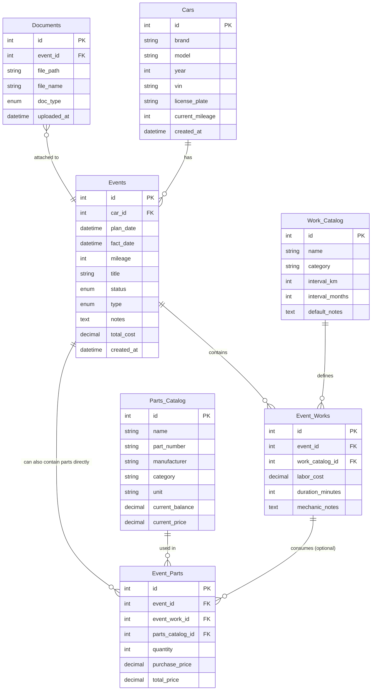

# Требования к проекту carService

Документ описывает функциональные и нефункциональные требования, основные пользовательские сценарии и целевую структуру данных.

## Функциональные требования

### Модуль 1. Управление автомобилями (автопарк)

- `FR-1`: добавление/редактирование автомобиля (марка, модель, год выпуска, VIN, госномер).
- `FR-2`: хранение текущего пробега с возможностью ручного обновления.
- `FR-2.1`: поддержка нескольких автомобилей и переключение контекста.

### Модуль 2. Журнал событий (ТО, ремонт, заправка)

- `FR-3`: добавление записи о плановом ТО.
- `FR-3.1`: детализация работ в событии (выбор из справочника + добавление "на лету").
- `FR-3.2`: редактируемые справочники:
  - работы;
  - запчасти;
  - расходные материалы.
- `FR-3.3`: состав работ:
  - количество запчастей/материалов;
  - стоимость работы;
  - примечание мастера.
- `FR-4`: добавление записи о ремонте/поломке.
- `FR-5`: добавление записи о заправке (объем, стоимость, топливо, пробег — опционально).

### Модуль 3. Напоминания

- `FR-6`: настройка регламентных интервалов (по км/дате).
- `FR-7`: расчет следующего ТО по последней операции и интервалу.
- `FR-7.1`: умные напоминания (привязка к конкретной работе + авто-черновик следующего события).
- `FR-8`: список предстоящих событий.

### Модуль 4. Медиафайлы и документы

- `FR-9`: прикрепление фото/документов к событиям.
- `FR-10`: галерея всех файлов по автомобилю.

### Модуль 5. Финансы

- `FR-11`: автоматический подсчет итоговой суммы по записи.
- `FR-12`: статистика затрат (месяц/год/типы работ).
- `FR-12.1`: прогноз бюджета на следующий период.
- `FR-13`: график расходов по месяцам.

## Нефункциональные требования

- `NFR-1` Безопасность: приложение работает локально или с защищенной авторизацией; данные авто считаются чувствительными.
- `NFR-2` Производительность: список событий должен быстро открываться при 500+ записях.
- `NFR-3` Удобство: создание типовой записи ТО должно занимать не более 15-20 секунд.
- `NFR-4` Резервное копирование: экспорт данных в JSON/CSV/Excel.

## Use Cases

### Use Case 1. Добавление нового автомобиля

**Актор:** владелец  
**Цель:** завести автомобиль в систему  
**Предусловие:** приложение открыто

**Основной сценарий:**

1. Пользователь нажимает "Добавить автомобиль".
2. Система открывает форму.
3. Пользователь вводит обязательные поля: марка, модель, пробег.
4. Нажимает "Сохранить".
5. Система валидирует поля и сохраняет автомобиль.
6. Открывается журнал выбранного авто.

**Альтернативный сценарий:**

- При незаполненных обязательных полях система показывает ошибку.

**Исключение:**

- Если VIN уже есть у другого автомобиля — система предупреждает о дубликате.

### Use Case 2. Создание планового события

**Актор:** владелец  
**Цель:** запланировать обслуживание  
**Предусловие:** есть хотя бы один автомобиль

**Основной сценарий:**

1. Пользователь нажимает "Добавить план".
2. Система открывает форму события:
   - статус `planned` (по умолчанию);
   - тип события;
   - плановая дата;
   - плановый пробег (опционально);
   - заголовок/примечание.
3. Пользователь добавляет работы (из справочника или новую).
4. Нажимает "Сохранить событие".
5. Система сохраняет и показывает событие в "Предстоящих".

**Альтернативный сценарий:**

- Для типа "Покупка запчастей" можно добавить запчасти без привязки к работам.

### Use Case 3. Закрытие планового события (выполнено)

**Актор:** владелец  
**Цель:** зафиксировать фактическое выполнение ТО/ремонта  
**Предусловие:** есть событие `planned`

**Основной сценарий:**

1. Пользователь открывает карточку запланированного события.
2. Нажимает "Выполнено"/"Закрыть".
3. Система показывает форму фактических данных.
4. Пользователь указывает фактическую дату, пробег, стоимость, прикрепляет документы.
5. Система валидирует данные и переводит событие в `completed`.
6. Обновляется текущий пробег автомобиля (если новый больше старого).
7. При наличии интервалов создается черновик следующего события.

### Use Case 4. Управление справочником запчастей

**Актор:** владелец  
**Цель:** добавить запчасть в справочник

**Основной сценарий:**

1. Пользователь нажимает "Добавить запчасть".
2. Заполняет поля (наименование, артикул, производитель, категория, единица, цена).
3. Нажимает "Сохранить".
4. Система проверяет уникальность связки "Наименование + Артикул".
5. Система сохраняет запись.

**Быстрое добавление:**

- Из формы события можно добавить новую запчасть "на лету" (сокращенная форма).

### Use Case 5. Просмотр статистики и прогноза

**Актор:** владелец  
**Цель:** оценить расходы за период и получить прогноз

**Основной сценарий:**

1. Пользователь открывает раздел "Статистика/Финансы".
2. Система показывает:
   - расходы по категориям;
   - динамику расходов по месяцам;
   - стоимость 1 км пробега;
   - прогноз бюджета на следующий период.
3. Пользователь выбирает период (месяц/квартал/год/все время).
4. При клике по категории видит детализацию.

**Логика прогноза:**

- анализ истории за последние 12 месяцев;
- учет интервалов повторяемых работ;
- учет средней стоимости с поправкой на инфляцию (например 5-10%).

## Целевая структура базы данных

